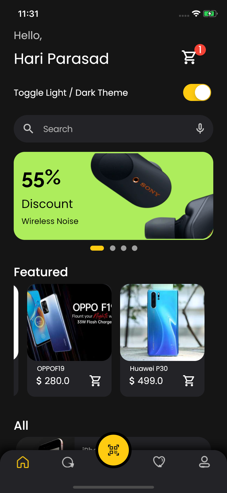
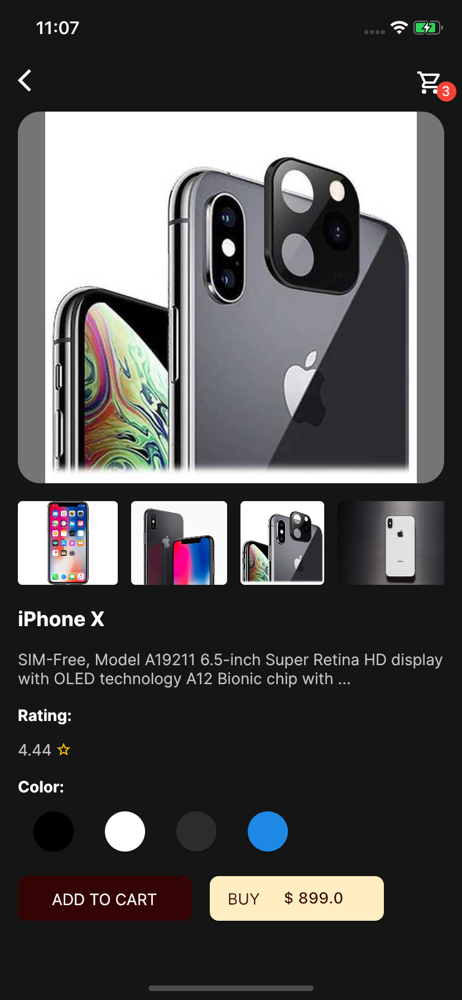
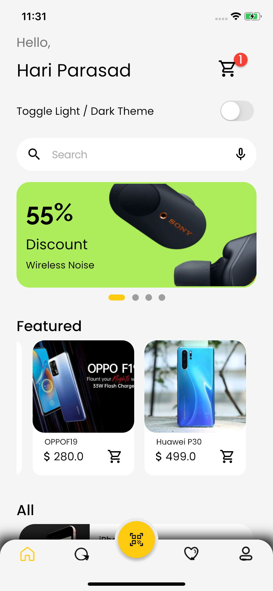
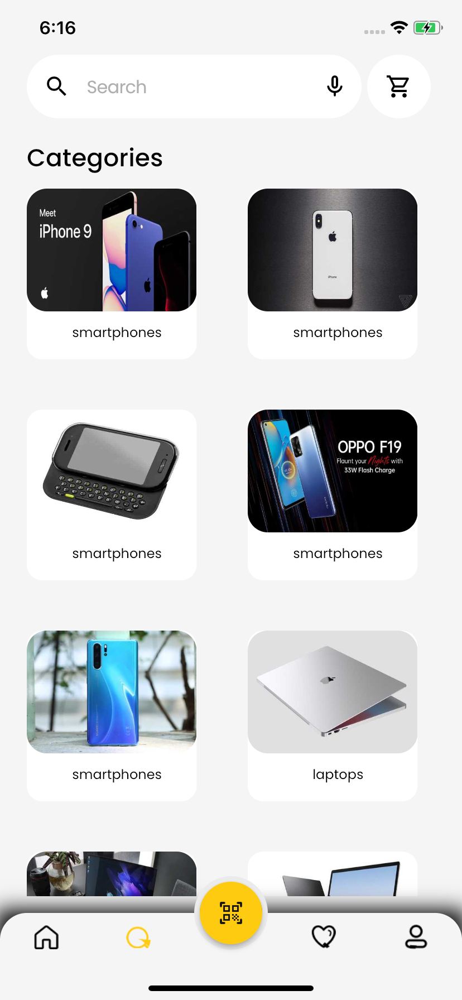
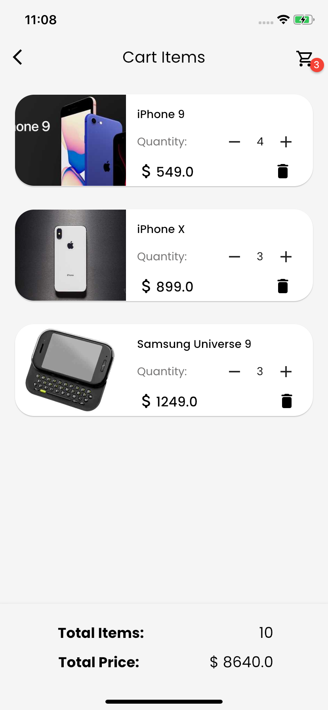
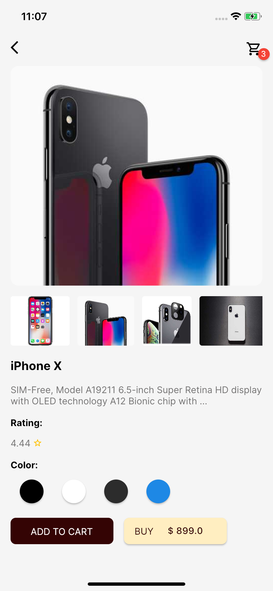

# Ecommerce App with Provider

The UI of this ecommerce mobile app is developed in flutter and designed in figma. The app includes main products page, detail page, category search page and shopping cart page.

Home page and category page design was taken from this design file.

https://www.figma.com/file/pseDCW8iNpIFlBhW2NXgua/Ecommerce-App-UI-Kit-(Community)?node-id=509%3A3606&t=L4Gg4jK7ARlnPDxf-0

Design of detail screen was taken from this design file.

https://www.figma.com/file/GrOkvCwCUlpfQcsBfkrK78/Online-ecommerce-app-(Community)?node-id=10%3A624&t=7LWBhFQcjKLoOBZl-0

# Video

# Screenshots

    .   

&nbsp;

        

&nbsp;

# App Overview

This application is composed of 4 main screens: overview, category search, detail and cart screens. The first page shows a list of featured and all products that are accessed from an dummy api https://dummyjson.com/docs/products. The second one shows grid of product category and a search option. The detail page displays the details about each product along with pictures. The last and final page that is the cart page shows a list of products in cart where the quantity can be increased and decreased and total items and price are shown at the bottom.

