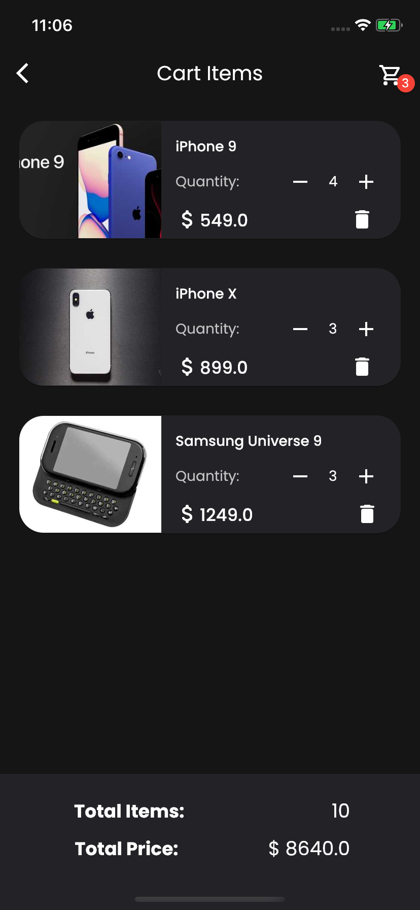

# ecommerce_app

UI of an ecommerce mobile app created in flutter designed in figma. The app includes main page where featured products and all products are displayed. Add and delete from cart functionality is also added.

https://www.figma.com/file/pseDCW8iNpIFlBhW2NXgua/Ecommerce-App-UI-Kit-(Community)?node-id=509%3A3606&t=L4Gg4jK7ARlnPDxf-0

Video

Screenshots

 
 
&nbsp;

&nbsp;

  
 
&nbsp;
   

&nbsp;

  
 
&nbsp;
 

 
&nbsp;

  
 
&nbsp;
   

